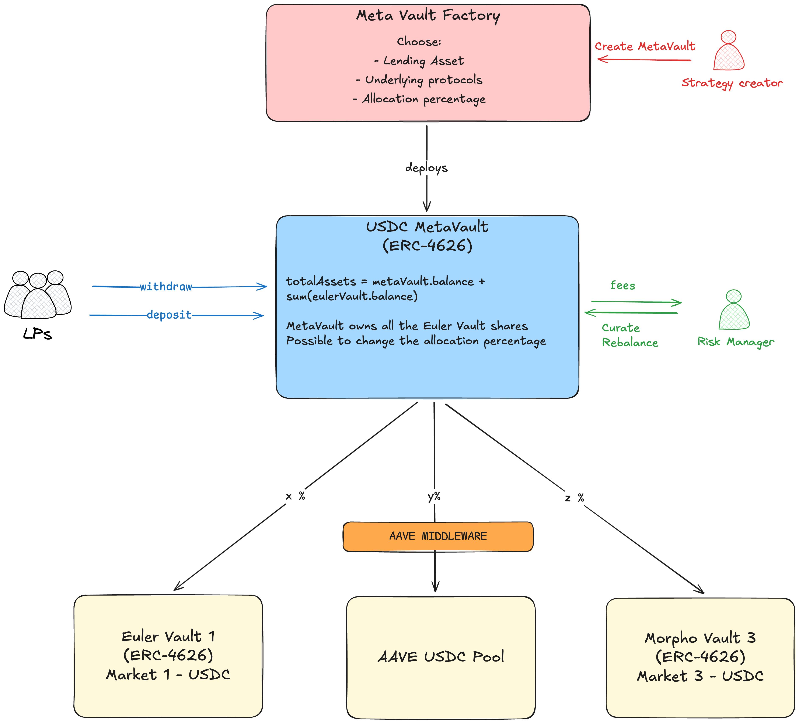

# Meta Vaults proof of concept

This project aims to be presented at EthGlobal 2025.

### Motivation
Decentralized finance (DeFi) offers countless yield opportunities within the Ethereum ecosystem. These are spread across a wide range of lending platforms, liquidity pools, staking protocols, automated market makers, and more.

Many of these opportunities can be wrapped into ERC-4626-compliant vaults, which serve to aggregate yields on a given platform. However, managing investments and tracking positions across multiple protocols quickly becomes complex.

Our solution is to aggregate these yields into higher-level vaults we call Meta-Vaults.

A curator defines a high-level strategy—for example, allocating 30% to staking via Vault A, 20% to lending via Vault B, and 50% to liquidity provision via Vault C. Meta-Vaults enable curators to deploy decentralized vaults via a Factory contract, apply their strategies, and earn fees in return.

These Meta-Vaults can also be used for advanced use cases such as arbitrage or market making.

If widely adopted, this system would benefit the entire ecosystem by deepening liquidity and efficiently distributing capital throughout DeFi.

### Technical details

At any time, the meta-vault has the following assets and liabilities:

| Liability               | Assets                        |
| ----------------------- | ----------------------------- |
| Meta-Vault Shares (MVS) | Underlying Asset Shares (UAS) |

When receiving liquidity, the liquidity is distributed to the middlewares following the weights. 

## Euler Integration

Thanks to the ERC-4626 standard, our system can natively interface with Euler Finance. This seamless compatibility enables Meta-Vaults to allocate or rebalance liquidity directly into and out of Euler, alongside other yield-generating opportunities.

By abstracting away protocol-specific logic, this integration simplifies strategy execution while unlocking efficient liquidity routing across multiple DeFi platforms—including lending, staking, and liquidity provisioning—all from a unified vault architecture.

## Going further

Although this project shows great promise, we weren't able to implement all planned features during the hackathon.
This section outlines the key functionalities we aim to develop next.

### Rebalancing

The contract stores the curator's address, who has the authority to rebalance and/or update the allocation percentages across the underlying vaults.

### Fees

By curating the vaults, the risk manager can take a fee on the rewards generated by the LPs.
This fee will be sent to the curator address every time LPs claim their rewards. It is a percentage of generated rewards.

### Factory

A factory contract will be created to streamline the deployment of MetaVaults.
It will automatically deploy the metaVault according to the information sent by the strategy creator.
Parameters to add:

- addresses of the Euler Vault, Morpho Vault and Aave MiddleWare
- allocation percentage of each vault
- public or private strategy
- fee taken by the curator
